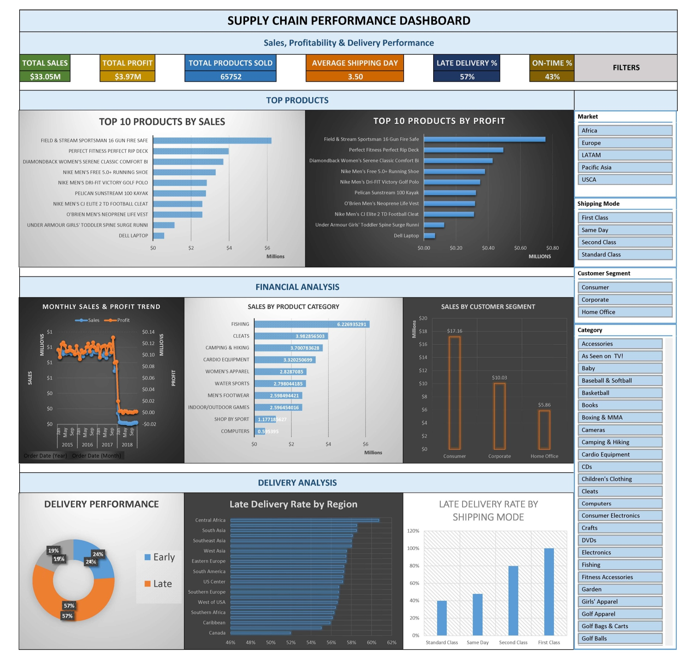

# Supply Chain Analytics Dashboard

An Excel-based supply chain analytics dashboard built to analyze sales, profitability, and delivery performance from 65K+ orders.

The goal of the project was to take raw order data, clean it, create useful delivery metrics, and turn the results into an interactive dashboard that can be used to understand business and supply chain performance.

### 🚀 [Live Dashboard](https://1drv.ms/x/c/9d46b6796e607595/IQD6U1e-S7atTYJF8Pgn5SYVAXcXN1-L5tcTuh61sgrHe00?e=Gep2cJ) · [⬇️ Download Excel Dashboard](https://drive.google.com/drive/folders/1QiTEvHVL9BFZt6umPsmwIgO4iLgadl13?usp=sharing)

## 📊 Dashboard Preview



## ⬇️ Download the Dashboard

Want to explore the dashboard yourself?

### [Download the Excel Dashboard](YOUR_RELEASE_DOWNLOAD_LINK)

> The Excel file is hosted as a GitHub Release because of its large file size.

The workbook contains the complete dashboard, PivotTables, Power Query transformations, calculated fields, and interactive slicers.

---

## What the Dashboard Shows

The dashboard focuses on three main areas:

### Sales & Profitability
- Total orders
- Total sales
- Total profit
- Monthly sales and profit trends
- Sales by product category
- Top 10 products by sales

### Delivery Performance
- Early, on-time and late deliveries
- Overall late delivery rate
- Average shipping time
- Late delivery rate by region
- Late delivery rate by shipping mode

### Business Analysis
- Customer segment performance
- Market-wise performance
- Shipping mode comparison
- Product-level sales and profit analysis

## Key Features

- Interactive dashboard built in Microsoft Excel
- Power Query used for data cleaning and transformation
- PivotTables used for analysis
- PivotCharts used for visualization
- Slicers for filtering the dashboard
- Calculated delivery metrics such as delay days, late flag and on-time flag
- Separate raw and cleaned datasets to keep the analysis organized

## Data Preparation

The original dataset contained order, product, customer, sales, delivery and geographical information.

For the dashboard, I cleaned the data using Power Query and removed fields that were not required for analysis, especially customer personal information.

I also created a few calculated fields:

- **Delivery Delay Days** = Actual Shipping Days − Scheduled Shipping Days
- **Late Flag** = 1 when the delivery was late, otherwise 0
- **On-Time Flag** = 1 when the delivery was on time or early
- **Delivery Performance** = Early / On Time / Late

These fields were then used throughout the dashboard.

## Tools Used

- **Microsoft Excel**
- **Power Query**
- **PivotTables**
- **PivotCharts**
- **Excel Slicers**
- **Data Cleaning & Analysis**

## Dashboard Structure

The workbook is organized into separate sheets:

```text
Raw_Data
    ↓
Clean_Data
    ↓
Pivot_Data
    ↓
Final Dashboard

```

**Raw_Data**

Contains the original dataset and is kept separate from the analysis.

**Clean_Data**

Contains the cleaned dataset and calculated delivery metrics.

**Pivot_Data**

Contains the PivotTables used to calculate and support the dashboard visuals.

**Final Dashboard**

Contains the final KPIs, charts and interactive filters.

## What I Learned

This project helped me get more comfortable with working with a relatively large dataset in Excel and turning raw order data into something that can actually be used for decision-making.

The main focus was not just creating charts, but understanding which metrics are useful for supply chain analysis and presenting them in a simple way.

## Future Improvements

Some possible improvements for a future version:

- Rebuild the dashboard in Power BI
- Add more detailed time-based analysis
- Add inventory-related metrics
- Add forecasting for demand and delivery performance
- Add geographical visualizations
- Automate data refresh and reporting

**Note:** The public repository does not contain the original raw customer data or personally identifiable information.
